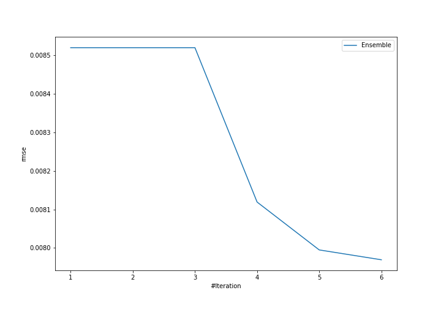
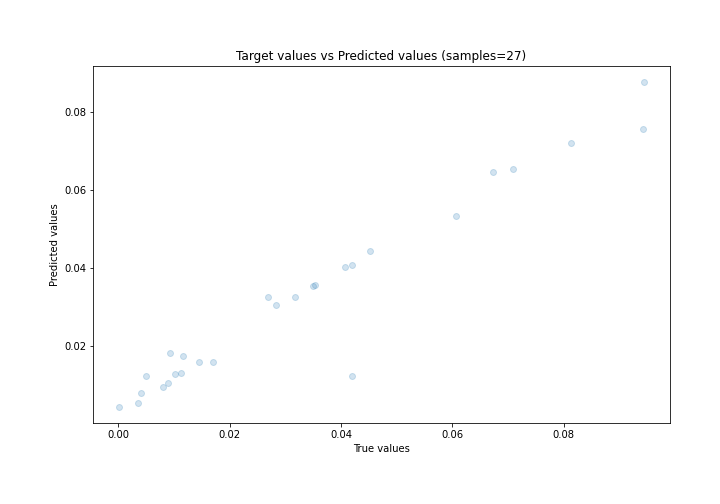
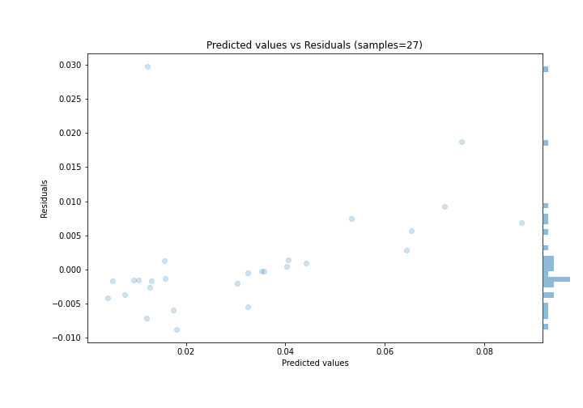

# Summary of Ensemble

[<< Go back](../README.md)

## Ensemble structure
| Model             |   Weight |
|:------------------|---------:|
| 4_Default_Xgboost |        6 |

### Metric details:
| Metric   |       Score |
|:---------|------------:|
| MAE      | 0.00445101  |
| MSE      | 7.29612e-05 |
| RMSE     | 0.00854173  |
| R2       | 0.906416    |
| MAPE     | 0.436292    |

## Learning curves

## True vs Predicted

## Predicted vs Residuals

[<< Go back](../README.md)
